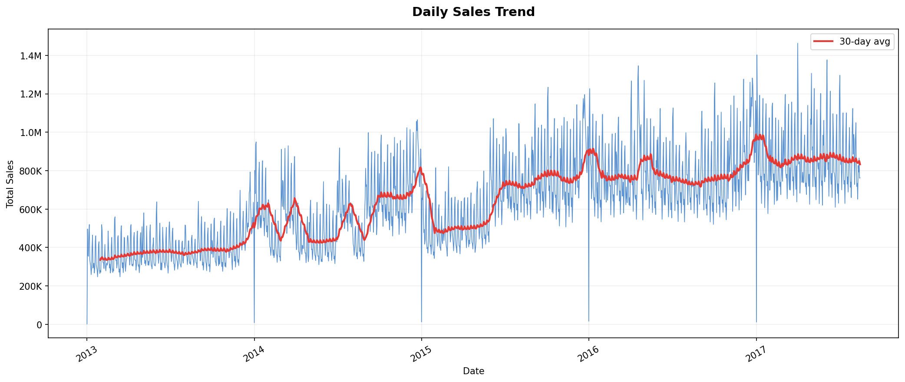
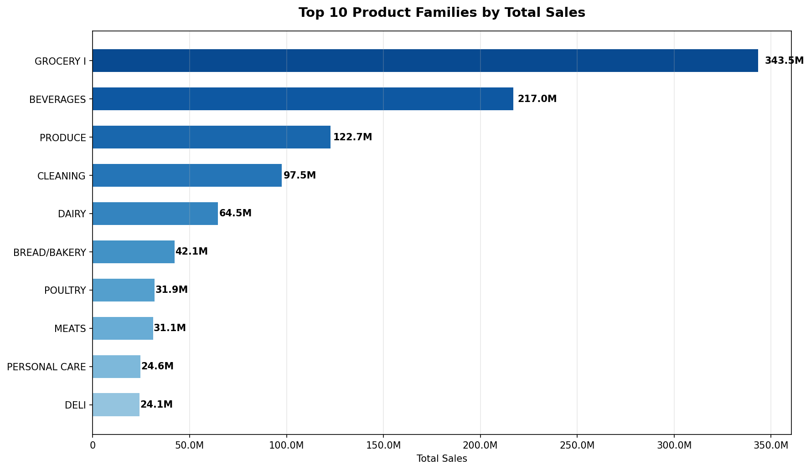
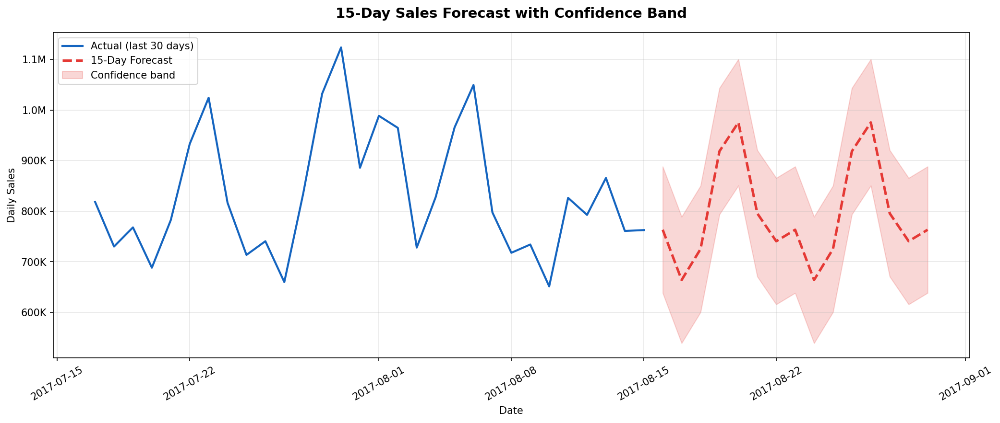

# Store Sales Time Series Forecasting
**Binod Kumar Jena | Data Analyst Portfolio Project**

## Dataset
Real data from Corporación Favorita — Ecuador's largest grocery chain
Source: kaggle.com/competitions/store-sales-time-series-forecasting

## Project Summary
- 3,000,888 daily sales records
- 54 stores | 33 product families | 2013–2017
- 6 data sources merged and analysed

## Key Findings
- Promotions drive **+195.5% sales uplift** — strongest demand driver
- Holidays drive **+11.6% uplift** — consistent stock planning signal
- Oil prices show **-0.597 correlation** with sales
- December is peak month | February is lowest
- **Random Forest** achieved best RMSE of **1.0935**
- 15-day forecast: **11,928,643 units**

## Tools Used
Python | Pandas | Scikit-learn | Matplotlib | Power BI | SQL

## Charts Preview

## Files
| File | Description |
|------|-------------|
| Store_Sales_Time_Series_Forcasting.ipynb | Full Python notebook |
| chart1 to chart9 .png | Individual dashboard charts |
| ps_*.csv | Clean data exports for Power BI |

## How to Run
1. Download dataset from Kaggle link above
2. Upload CSV files to Google Colab
3. Open the .ipynb notebook and run all cells
